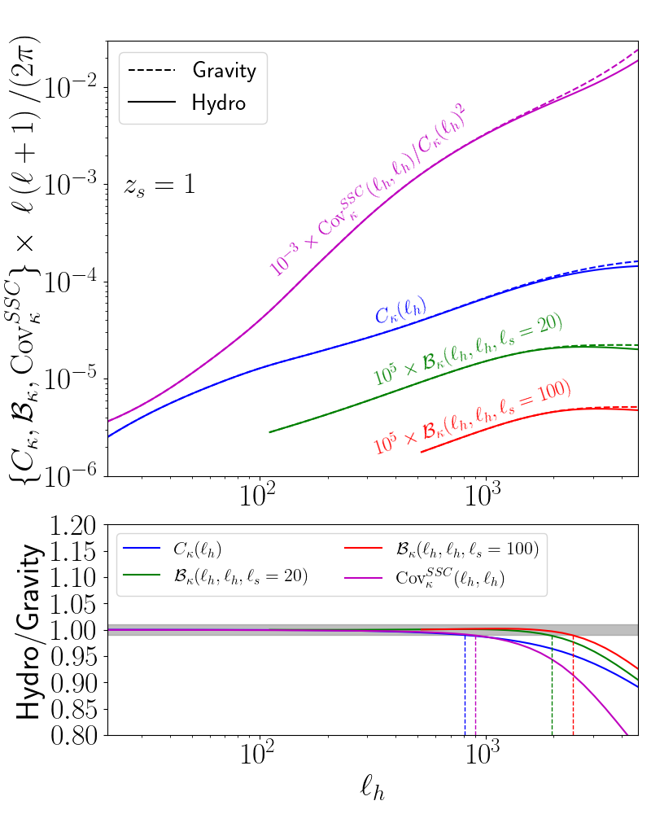
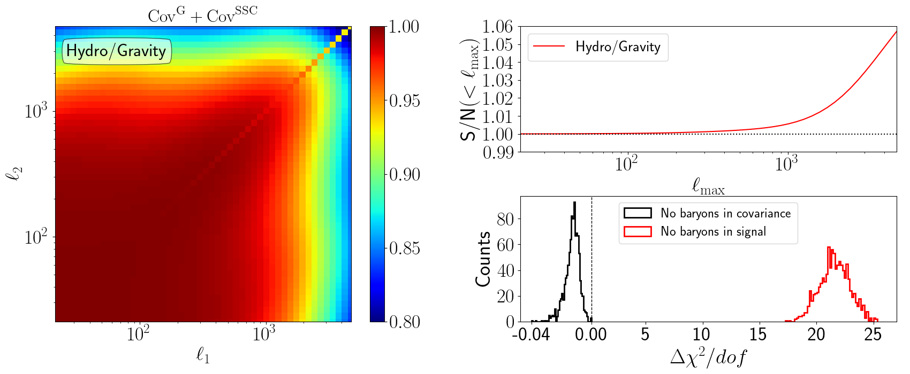
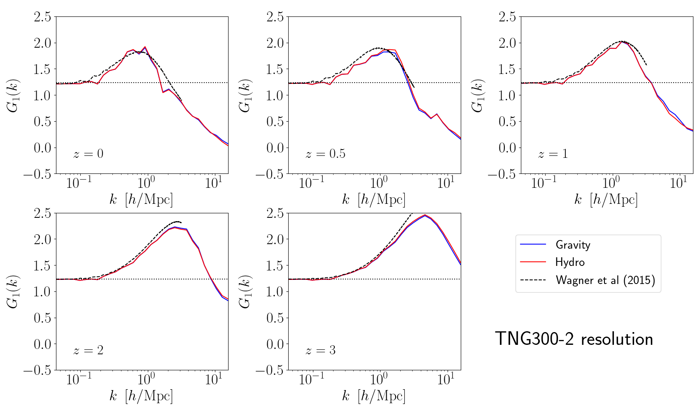

# Hydrodynamical effects on higher-order lensing statistics

This code works out the impact of hydrodynamical baryonic feedback effects on 2-, 3- and 4-point weak lensing data statistics. This was used in the numerical analysis of the paper:

- Barreira et al 2019, https://arxiv.org/abs/1904.02070

The calculation of the 3- and 4-point functions uses the formalism of the [Response Approach to Perturbation Theory](https://arxiv.org/abs/1703.09212), and the baryonic effects are according to the IllustrisTNG galaxy formation model.

Crucial to this calculation was the development, for the first time, of Separate Universe N-body hydrodynamical simulations of galaxy formation to measure the response function $G_1$.

### Dependencies

- python (numpy, scipy, matplotlib)

### Code overview

- *prepare_for_lensing.py* defines global parameters and functions. It is imported by the other scripts.

- *compute_kappa_spectra.py* computes the 2-point and the squeezed 3-point function.
  
- *compute_cov_g.py* and *compute_cov_ssc_limber.py* compute the 2-point function covariance (which is a 4-point function). It includes the two most important contributions: the Gaussian (cov_g) and the super-sample covariance (cov_ssc) terms.

- The folder lookup_tables/ contains tables with 3D power spectra, and N-body simulation data used in the calculation.

- The folder plots/ contains the plotting scripts.

### Gallery

Impact of hydrodynamical effects on the gravity-only calculation of 2-, 3- and 4-point weak lensing functions

Impact of hydrodynamical effects on the covariance on signal-to-noise and goodness-of-fit for parameter inference analyses

Impact of hydrodynamical effects on the density first-order response function $G_1$ from separate universe simulations

